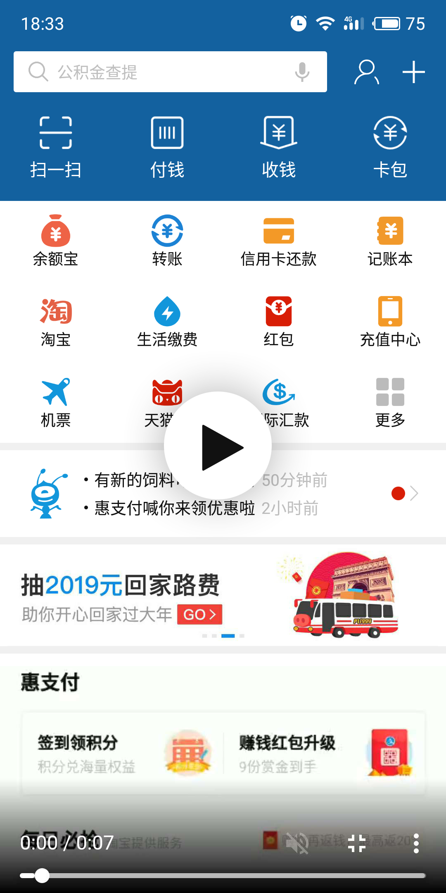

### 支付宝首页下拉刷新
支付宝首页的下拉刷新效果不走寻常路，跟我们理解的很不一样。它在下拉刷新时，分成上下两段（topLayout & bottomLayout），loading动画处于中间的位置。在拖拽的时候，就像是从中间撕开的样子。<br/><br/>
真要细细琢磨起来，这样的下拉刷新效果，确实挺难搞的。在页面中的任何一处都能上下拖动，相当考验细心和耐心。

### 截图
效果图如下：<br/>
<a href="https://xmusistone.github.io/capture/video.html?content=alipayCapture1.mp4" target="_blank">
  
</a>

点击图片可查看[截屏视频](https://xmusistone.github.io/capture/video.html?content=alipayCapture1.mp4)

### 原理说明
或许很多人都想到了CoordinatorLayout，诚然，CoordinatorLayout是距离这种下拉刷新效果最近的官方控件。但是，有一些体验上的问题，却是CoordinatorLayout也无能为力的。比如说：在topLayout按下触摸，向下拖动时，怎么把loading动画慢慢显示出来? 或者，topLayout向上拖动，以较快的速度松手时，fling效果如何传达到bottomLayout？<br/><br/>
或许你会说，我们自定义CoordinatorLayout...<br/><br/>
我不否认这可能是一种可行的方案，如果你对其源码足够了解，如果你对Nesting机制和behavior有足够的掌控力。<br/><br/>
可是我也想问，如果**这些如果**都能成真的话，干嘛不来一次全新的旅程？<br/><br/>
CoordinatorLayout和Nesting机制告诉我们，一次Touch拖动事件，并不是一次性消费的，而是可以被多个View同时消费。如果你涉猎过足够多的系统源码，会知道Nesting机制的核心是MotionEvent有一个bug级的方法offsetLocation。这是一个public方法，我们在处理Touch事件时一样可以调用。<br/><br/>
然而无论如何，CoordinatorLayout规规矩矩做事，本本分分做View，跟我们理解的Touch事件分发机制是并不冲突的。<br/><br/>

我曾经做过一个试验：
1. FrameLayout包含两个子View，第一个子View是ScrollView，放在底部；第二个子View是TextView(MATCH_PARENAT)放在顶部，用作遮罩，背景透明;
2. 我用手指滑动屏幕，ScrollView可以正常滚动；
3. 将TextView设置成可点击的，setClickable(true)，用手指滑动屏幕时，ScrollView无法正常滚动。
4. 自定义FrameLayout，onInterceptTouchEvent和onTouchEvent在自行处理的同时，也转发给scrollView，scrollView可以正常滑动;

关键代码如下：
```java
public class AlipayContainerLayout extends FrameLayout {

    @Override
    public boolean onInterceptTouchEvent(MotionEvent ev) {
        scrollView.onInterceptTouchEvent(ev);
        return super.onInterceptTouchEvent(ev);
    }
    
    @Override
    public boolean onTouchEvent(MotionEvent event) {
        scrollView.onTouchEvent(event);
        return true;
    }
}
```

你可能会说：**这扰乱了Touch事件的分发流程，简直就是在胡搞！**<br/>
是的，不得不承认这确实是耍流氓，是一种**违法行为**！呵呵，淡定，不要鸡冻！我能想起很多开源框架，用反射、用Hook的方式欺骗系统、绕过检查等等，跟它们比起来，我们只能算轻微的投机倒把而已（捂脸），不要方！<br/><br/>
那么，支付宝的首页刷新是不是可以理解成这样：
1. FrameLayout包含两个子View，第一个子View是ScrollView，第二个子View是topLayout；
2. ScrollView顶部留白，占位用；
3. ScrollView消费Touch事件；如果触摸滑动落在topLayout，则Touch事件由FrameLayout转发给ScrollView；如果触摸滑动落在ScrollView内部，则ScrollView调用自身的Touch消费即可；

感兴趣的同学可以先这么试试看。<br/><br/>
可以透露的是，你一定会遇到林林总总的麻烦。不用怕，这些都是考验，走过九九八十一道坎，你会对系统底层的理解更进一步；而且，前文提及offsetLocation是个好东西，能用好这个彩蛋，绝对是一件值得开心的事情。<br/><br/>

### 使用方法
1. layout布局文件
```xml
<com.stone.alipay.library.AlipayContainerLayout
    android:id="@+id/home_container_layout"
    android:layout_width="match_parent"
    android:layout_height="match_parent"
    alipay:progressColor="@color/statusBarColor"
    alipay:progressCenterOffset="3dp"
    alipay:progressHeight="@dimen/alipay_progress_height" />
```
2. java代码使用
```java
    containerLayout = findViewById(R.id.home_container_layout)
    containerLayout.setDecorator(new AlipayContainerLayout.Decorator() {
        @Override
        public View getContentView() {
            // 内部滑动的scrollView content
            View contentView = initContentView(inflater);
            return contentView;
        }

        @Override
        public View getTopLayout() {
            // 顶部悬浮的topLayout
            topLinearLayout = (TopLinearLayout) initTopLayout(inflater);
            return topLinearLayout;
        }
    });

    // 2. 下拉刷新
    scrollView = containerLayout.getScrollView();
    scrollView.setOnRefreshListener(new AlipayScrollView.OnRefreshListener() {
        @Override
        public void onRefresh() {
            // 下拉刷新回调，请求网络数据
            requestNetwork();
        }
    });

    // 3. 顶部视差效果绑定
    scrollView.setScrollChangeListener(new AlipayScrollView.ScrollChangeListener() {
        @Override
        public void onScrollChange(int scrollY) {
            parallaxScroll(scrollY);
        }
    });
    topLinearLayout.bindParallax(scrollView, topBlueLayout);
```

### demo APK下载
[点击下载](https://github.com/xmuSistone/AlipayPullRefresh/blob/master/app-release.apk?raw=true)
